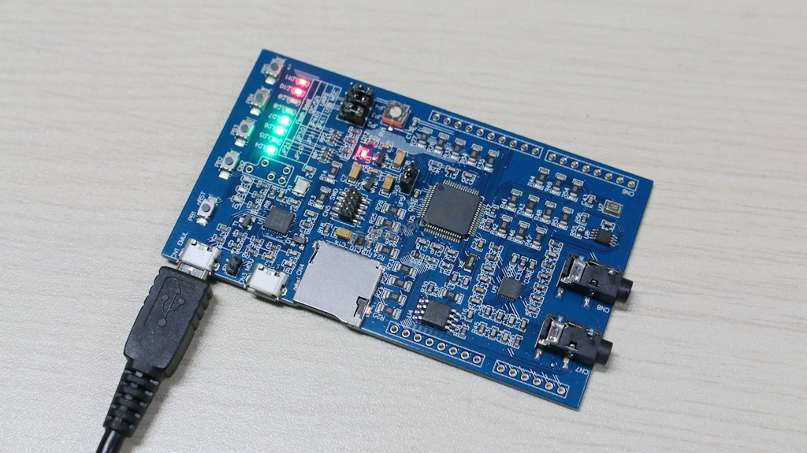

# serprog-lpc54114-lite

_flashrom serprog implemention on lpc54114-lite._

## serprog

[About serprog](https://flashrom.org/Serprog)

## lpc54114-lite



## usage

This project build with `make` and `arm-none-eabi-gcc` under Debian/Linux, can also build with other Linux distribution.

Make sure installed all software needed, then just execute

```shell
make
make flash
```

## reference

[Linux 下离线烧写 SPI 闪存](http://blog.dword1511.info/?p=4107)

[Tiny USB](https://github.com/hathach/tinyusb)
